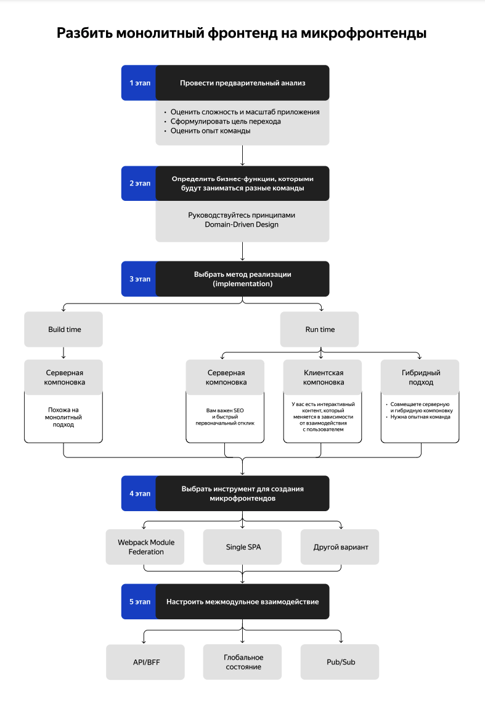

# Микрофронтенды

## Ознакомение с кодом проекта

### Структура проекта

> Посмотрите, как организованы директории и файлы в проекте.
> Обратите внимание на ключевые директории, такие как `src`, `components`, `styles`, `utils`.

На верхнем уровне проекта присутствует файлы Docker Compose, что говорит о том, что Докер является инструментом для запуска нескольких контейнеров:

- MongoDB - не экпозирует порт
- backend-test
- backend - порт на хосте `3001`
- frontend-test
- frontend - порт на хосте `3000`

На верхнем уровне присутствуют файлы Dockerfile.backend
Dockerfile.frontend. Базовые образы сделаны из node:18-slim

В проекте присутствует CI-файл для исполнения на GitHub workflows

Основные директории

- src/ – Основной код проекта (back- и frontend)
  - frontend:
    - components/ – Каталог компонентов пользовательского интерфейса.
    - styles/ – Стили приложения.
    - utils/ – Вспомогательные функции и утилиты.
    - App.ts – Основной компонент приложения.
    - routes/ – Конфигурация маршрутов для фронтенда.
  - backend:
    - models/ – Модели данных для MongoDB.
    - routes/ – API-эндпоинты.
    - controllers/ – Логика обработки запросов.
    - middlewares/ – Middleware-функции.

Дополнительные файлы

- package.json – Перечень зависимостей проекта и их версии.
- utils.js – Вспомогательные функции, используемые в компонентах.
- Тестовые файлы – Контейнеры backend-test и frontend-test, которые выполняют тестирование отдельных сервисов.

### Компоненты и модули

> Найдите основные компоненты проекта и посмотрите, как они организованы.
> Обратите внимание на компоненты высшего уровня — например, App.js. Посмотрите, как они взаимодействуют с дочерними компонентами.

Анализ App.js и структуры компонентов проекта

1. Основная роль App.js

    Файл App.js является корневым компонентом React-приложения. Он выполняет следующие функции:
    • Управляет глобальным состоянием приложения через useState.
    • Подключает маршрутизацию через react-router-dom (Switch, Route, useHistory).
    • Взаимодействует с API для загрузки и обновления данных (api.js).
    • Управляет контекстом пользователя через CurrentUserContext.
    • Обрабатывает авторизацию и аутентификацию (auth.js).
    • Взаимодействует с дочерними компонентами, включая страницы, попапы и защищённые маршруты.

2. Основные компоненты и их взаимодействие

    В App.js импортируются и используются следующие ключевые компоненты:

    - **Header** Отображает навигацию и email пользователя.
    - **Main** Основной контент приложения, отображает карточки.
    - **Footer** Нижний колонтитул страницы.
    - **PopupWithForm** Общий шаблон для попапов.
    - **EditProfilePopup** Модальное окно редактирования профиля.
    - **EditAvatarPopup** Модальное окно редактирования аватара.
    - **AddPlacePopup** Модальное окно добавления новой карточки.
    - **ImagePopup** Просмотр изображения в полноэкранном режиме.
    - **Register** Форма регистрации.
    - **Login** Форма входа.
    - **InfoTooltip** Сообщения об успешной или неудачной регистрации.
    - **ProtectedRoute** Компонент для маршрутизации защищённых страниц.

    Маршрутизация (react-router-dom)

    В App.js используется Switch и Route для маршрутизации страниц:
    • /signup → Register
    • /signin → Login
    • / (главная страница) → Main (защищённый маршрут через ProtectedRoute)

    Контекст и передача данных
    • CurrentUserContext.Provider передаёт данные о пользователе (currentUser) в компоненты.
    • useEffect загружает данные о пользователе и карточках при монтировании.

    Работа с API

    Методы API используются для:
    • Загрузки данных (getAppInfo).
    • Обновления профиля (setUserInfo).
    • Обновления аватара (setUserAvatar).
    • Лайков и удаления карточек (changeLikeCardStatus, removeCard).
    • Добавления карточек (addCard).

3. Взаимодействие компонентов

   • App.js хранит в state данные о пользователе и карточках.
   • Main получает cards и колбэки для управления карточками (onCardLike, onCardDelete).
   • Модальные окна (EditProfilePopup, EditAvatarPopup, AddPlacePopup) получают isOpen, onClose и обработчики обновления данных.
   • ProtectedRoute используется для защиты главной страницы (/), доступной только аутентифицированным пользователям.
   • Авторизация (onLogin, onRegister, onSignOut) управляет состоянием входа и выхода.

Выводы

Файл App.js — это центр управления состоянием, навигацией и взаимодействием с API. Он организует логику приложения, предоставляя данные дочерним компонентам через props и контекст. Взаимодействие компонентов выстроено логично: глобальные данные хранятся в App.js, передаваясь дальше вниз по дереву компонентов.

### Маршрутизация

> Проверьте, как настроены маршруты в проекте.
> Посмотрите, какие страницы и компоненты связаны с определёнными маршрутами.

#### Настройка маршрутов в проекте

    Маршрутизация в проекте реализована с использованием react-router-dom, и основные маршруты объявлены в файле App.js.
    Компоненты Route, Switch, useHistory, и ProtectedRoute управляют навигацией в приложении.

1. Импортируемые модули для маршрутизации

    В начале `App.js` импортируются необходимые зависимости:

    ```javascript
    import { Route, useHistory, Switch } from "react-router-dom";
    import ProtectedRoute from "./ProtectedRoute";
    ```

    - `Switch` – позволяет переключаться между маршрутами и рендерит только первый подходящий Route.
    - `Route` – определяет маршруты и компоненты, которые должны рендериться при совпадении URL.
    - `useHistory` – предоставляет возможность программно управлять навигацией.
    - `ProtectedRoute` – оборачивает защищённые маршруты, требующие аутентификации.

2. Объявленные маршруты

    Внутри return() в App.js определены маршруты:

    ```javascript
    <Switch>
      <ProtectedRoute
        exact
        path="/"
        component={Main}
        cards={cards}
        onEditProfile={handleEditProfileClick}
        onAddPlace={handleAddPlaceClick}
        onEditAvatar={handleEditAvatarClick}
        onCardClick={handleCardClick}
        onCardLike={handleCardLike}
        onCardDelete={handleCardDelete}
        loggedIn={isLoggedIn}
      />
      <Route path="/signup">
        <Register onRegister={onRegister} />
      </Route>
      <Route path="/signin">
        <Login onLogin={onLogin} />
      </Route>
    </Switch>
    ```

3. Разбор маршрутов

    Маршрут Компонент Описание

    - /Main Главная страница, защищённый маршрут (ProtectedRoute), доступен только аутентифицированным пользователям.
    - /signup Register Страница регистрации нового пользователя.
    - /signin Login Страница входа в систему.

4. Защищённые маршруты

    Для главной страницы (/) используется ProtectedRoute, который проверяет, авторизован ли пользователь:

    ```javascript
    <ProtectedRoute
      exact
      path="/"
      component={Main}
      loggedIn={isLoggedIn}
    />
    ```

    Если пользователь не авторизован (isLoggedIn === false), то его перенаправят на /signin.

    Логика ProtectedRoute:

    ```javascript
    import React from "react";
    import { Route, Redirect } from "react-router-dom";

    function ProtectedRoute({ component: Component, loggedIn, ...props }) {
      return (
        <Route>
          {() => (loggedIn ? <Component {...props} /> : <Redirect to="/signin" />)}
        </Route>
      );
    }

    export default ProtectedRoute;
    ```

5. Автоматический редирект после входа

    После успешного логина вызывается:

    ```javascript
    function onLogin({ email, password }) {
      auth
        .login(email, password)
        .then((res) => {
          setIsLoggedIn(true);
          setEmail(email);
          history.push("/");
        })
        .catch((err) => {
          setTooltipStatus("fail");
          setIsInfoToolTipOpen(true);
        });
    }
    ```

    Метод `history.push("/")` перенаправляет пользователя на главную страницу.

Вывод

- В проекте три маршрута: /, /signup, /signin.
- Главная страница (/) защищена с помощью ProtectedRoute.
- После успешной авторизации пользователь автоматически переходит на /.
- Незарегистрированные пользователи могут зайти на /signup или /signin.
- Маршрутизация логично разделена, а ProtectedRoute обеспечивает безопасность страниц.

### Зависимости проекта

> Проверьте файл package.json, чтобы узнать, какие библиотеки (а также их версии) и пакеты используются в проекте.
> Обратите внимание на библиотеки, которые управляют состояниями.

Анализ зависимостей в package.json

Файл package.json содержит список зависимостей и пакетов, используемых в проекте. Разберём ключевые библиотеки, особенно те, которые управляют состоянием.

1. Основные зависимости (dependencies)

    ```json
    "dependencies": {
      "@testing-library/jest-dom": "^5.11.4",
      "@testing-library/react": "^11.1.0",
      "@testing-library/user-event": "^12.1.10",
      "react": "^17.0.2",
      "react-dom": "^17.0.2",
      "react-router-dom": "^5.2.0",
      "react-scripts": "4.0.3",
      "web-vitals": "^1.0.1"
    }
    ```

    Разбор ключевых зависимостей:

    Библиотека Версия Назначение
    react ^17.0.2 Основной фреймворк React.
    react-dom ^17.0.2 Взаимодействие React с DOM.
    react-router-dom ^5.2.0 Управление маршрутизацией в SPA.
    react-scripts 4.0.3 Сборка и настройка React-приложения.
    @testing-library/react ^11.1.0 Тестирование React-компонентов.
    @testing-library/jest-dom ^5.11.4 Расширенные матчеры для тестирования DOM.
    @testing-library/user-event ^12.1.10 Симуляция пользовательских событий.
    web-vitals ^1.0.1 Анализ метрик производительности.

2. Dev-зависимости (devDependencies)

    ```json
    "devDependencies": {
      "@playwright/test": "^1.45.0",
      "@types/node": "^20.14.9",
      "dotenv": "^16.0.2",
      "wait-port": "^1.1.0"
    }
    ```

    Библиотека Версия Назначение
    @playwright/test ^1.45.0 Инструмент для end-to-end тестирования.
    @types/node ^20.14.9 Поддержка TypeScript для Node.js API.
    dotenv ^16.0.2 Работа с переменными окружения .env.
    wait-port ^1.1.0 Ожидание доступности порта перед запуском сервиса.

3. Управление состоянием

    В package.json нет таких библиотек, как Redux, MobX или React Query, что говорит о том, что состояние управляется встроенными механизмами React:

    - useState – для локального состояния компонентов.
    - useEffect – для работы с асинхронными операциями (например, загрузка данных).
    - Контекст API (Context.Provider) – для глобального состояния (CurrentUserContext в App.js).

Вывод

Проект использует React 17 и работает на react-router-dom 5.
Состояние управляется стандартными хуками React (useState, useEffect) и контекстом (Context API).
Нет Redux или MobX, что говорит о простом управлении данными.

### Утилиты и вспомогательные функции

> Найдите файлы с утилитами и вспомогательными функциями — например, utils.js.
> Посмотрите, как эти утилиты используются в компонентах и какие общие функции они выполняют.

#### Анализ вспомогательных функций и утилит в проекте

Файл с утилитами в данном проекте — `src/utils/api.js`.
Он отвечает за взаимодействие с API и содержит методы для работы с пользователем, карточками и лайками.

1. Файл `api.js` — утилита для работы с сервером

    Этот файл инкапсулирует все запросы к серверу. Используется в App.js для загрузки и обновления данных.

    Структура API-класса (Api)

    Класс Api принимает параметры конфигурации:

    ```javascript
    class Api {
      constructor({ address, token, groupId }) {
        this._token = token;
        this._groupId = groupId;
        this._address = address;
      }
    }
    ```

    API использует:

    - fetch для HTTP-запросов.
    - Методы GET, POST, DELETE, PATCH.
    - Обработку ответов с проверкой статуса HTTP.

2. Основные методы api.js

    Запрос информации о пользователе и карточках

    ```js
    getAppInfo() {
      return Promise.all([this.getCardList(), this.getUserInfo()]);
    }
    ```

    Этот метод загружает сразу список карточек и данные пользователя.

    Работа с карточками

    Получение списка карточек:

    ```js
    getCardList() {
      return fetch(`${this._address}/${this._groupId}/cards`, {
        headers: { authorization: this._token },
      }).then(res => res.ok ? res.json() : Promise.reject(`Ошибка: ${res.status}`));
    }
    ```

    Добавление новой карточки:

    ```js
    addCard({ name, link }) {
      return fetch(`${this._address}/${this._groupId}/cards`, {
        method: 'POST',
        headers: {
          authorization: this._token,
          'Content-Type': 'application/json',
        },
        body: JSON.stringify({ name, link }),
      }).then(res => res.ok ? res.json() : Promise.reject(`Ошибка: ${res.status}`));
    }
    ```

    Удаление карточки:

    ```js
    removeCard(cardID) {
      return fetch(`${this._address}/${this._groupId}/cards/${cardID}`, {
        method: 'DELETE',
        headers: { authorization: this._token },
      }).then(res => res.ok ? res.json() : Promise.reject(`Ошибка: ${res.status}`));
    }
    ```

    Работа с пользователем

    Получение информации о пользователе:

    ```js
    getUserInfo() {
      return fetch(`${this._address}/${this._groupId}/users/me`, {
        headers: { authorization: this._token },
      }).then(res => res.ok ? res.json() : Promise.reject(`Ошибка: ${res.status}`));
    }
    ```

    Обновление данных профиля:

    ```js
    setUserInfo({ name, about }) {
      return fetch(`${this._address}/${this._groupId}/users/me`, {
        method: 'PATCH',
        headers: {
          authorization: this._token,
          'Content-Type': 'application/json',
        },
        body: JSON.stringify({ name, about }),
      }).then(res => res.ok ? res.json() : Promise.reject(`Ошибка: ${res.status}`));
    }
    ```

    Обновление аватара:

    ```js
    setUserAvatar({ avatar }) {
      return fetch(`${this._address}/${this._groupId}/users/me/avatar`, {
        method: 'PATCH',
        headers: {
          authorization: this._token,
          'Content-Type': 'application/json',
        },
        body: JSON.stringify({ avatar }),
      }).then(res => res.ok ? res.json() : Promise.reject(`Ошибка: ${res.status}`));
    }
    ```

    Работа с лайками

    Метод changeLikeCardStatus позволяет ставить и убирать лайки:

    ```js
    changeLikeCardStatus(cardID, like) {
      return fetch(`${this._address}/${this._groupId}/cards/like/${cardID}`, {
        method: like ? 'PUT' : 'DELETE',
        headers: {
          authorization: this._token,
          'Content-Type': 'application/json',
        },
      }).then(res => res.ok ? res.json() : Promise.reject(`Ошибка: ${res.status}`));
    }
    ```

3. Использование api.js в App.js

    Файл api.js активно используется в App.js:

    Получение данных при загрузке страницы

    ```js
    React.useEffect(() => {
      api.getAppInfo()
        .then(([cardData, userData]) => {
          setCurrentUser(userData);
          setCards(cardData);
        })
        .catch((err) => console.log(err));
    }, []);
    ```

    Обновление информации о пользователе

    ```js
    function handleUpdateUser(userUpdate) {
      api.setUserInfo(userUpdate)
        .then((newUserData) => {
          setCurrentUser(newUserData);
          closeAllPopups();
        })
        .catch((err) => console.log(err));
    }

    Добавление новой карточки

    function handleAddPlaceSubmit(newCard) {
      api.addCard(newCard)
        .then((newCardFull) => {
          setCards([newCardFull, ...cards]);
          closeAllPopups();
        })
        .catch((err) => console.log(err));
    }
    ```

    Лайк/дизлайк карточки

    ```js
    function handleCardLike(card) {
      const isLiked = card.likes.some((i) => i._id === currentUser._id);
      api.changeLikeCardStatus(card._id, !isLiked)
        .then((newCard) => {
          setCards((cards) =>
            cards.map((c) => (c._id === card._id ? newCard : c))
          );
        })
        .catch((err) => console.log(err));
    }
    ```

4. Вывод

    Файл api.js — это основная утилита для работы с API.
    Он инкапсулирует логику работы с сервером и гарантирует единообразие обработки запросов.

    Основные задачи api.js:

    ✅ Загружает данные о пользователе и карточках.
    ✅ Позволяет добавлять/удалять карточки.
    ✅ Управляет лайками.
    ✅ Обновляет профиль пользователя и аватар.
    ✅ Отделяет логику API от компонентов (чистая архитектура).

    Использование этого API-класса в App.js обеспечивает централизованное управление данными, что упрощает код и повышает его читаемость. 🚀

### Стили и их организация

> Проверьте, как организованы стили в проекте.
> Обратите внимание на файлы стилей, которые могут быть связаны с конкретными компонентами.

Организация стилей в проекте

Проект использует методологию БЭМ (Block-Element-Modifier) для организации CSS.
Файл frontend/src/index.css импортирует стили, сгруппированные по блокам.

1. Глобальные стили

    Файл index.css

    ```css
    @import url('./vendor/normalize.css');
    @import url('./vendor/fonts.css');
    ```

    - normalize.css – сбрасывает стили браузера, обеспечивая кросс-браузерную совместимость.
    - fonts.css – подключает кастомные шрифты.

2. Структура CSS по БЭМ

    Стили разбиты по блокам, и каждый блок имеет собственный CSS-файл.

    ```css
    @import url('./blocks/page/page.css');
    @import url('./blocks/header/header.css');
    @import url('./blocks/content/content.css');
    @import url('./blocks/footer/footer.css');
    @import url('./blocks/profile/profile.css');
    @import url('./blocks/places/places.css');
    @import url('./blocks/card/card.css');
    @import url('./blocks/popup/popup.css');
    @import url('./blocks/popup/_is-opened/popup_is-opened.css');
    @import url('./blocks/auth-form/auth-form.css');
    ```

    Файл	Описание блока
    - page.css	Общие стили для всей страницы.
    - header.css	Стили для хедера (логотип, навигация, email пользователя).
    - content.css	Основной контейнер страницы.
    - footer.css	Стили для нижнего колонтитула.
    - profile.css	Оформление профиля пользователя.
    - places.css	Размещение карточек на главной странице.
    - card.css	Оформление карточек (изображение, описание, лайки, удаление).
    - popup.css	Основной стиль попапов (модальных окон).
    - popup_is-opened.css	Модификатор, который добавляет класс is-opened к попапу.
    - auth-form.css	Стили для формы входа и регистрации.

3. Использование стилей в компонентах

    Компоненты загружают соответствующие стили, например:

    Компонент Header.js

    ```js
    import './blocks/header/header.css';

    function Header() {
      return (
        <header className="header">
          <h1 className="header__title">Мой проект</h1>
        </header>
      );
    }
    ```

    Компонент Popup.js

    ```js
    import './blocks/popup/popup.css';
    import './blocks/popup/_is-opened/popup_is-opened.css';

    function Popup({ isOpen }) {
      return (
        <div className={`popup ${isOpen ? "popup_is-opened" : ""}`}>
          <div className="popup__content">...</div>
        </div>
      );
    }
    ```

4. Подход к стилизации

    ✅ Используется БЭМ – стили делятся на блоки, что делает код читаемым.
    ✅ CSS-модули не используются – стили загружаются напрямую в компонентах.
    ✅ Нет CSS-in-JS – проект использует классический CSS.

    Вывод:
    Стилизация организована структурированно. Каждый компонент загружает только нужные ему стили, что делает код чистым и масштабируемым. 🚀

## Решение проекта

### Уровень 1. Проектирование

> Выберите фреймворк для создания микрофронтендов и опишите решение в удобном вам виде.



#### 1 этап. Провести предварительный анализ

Согласно принципам разбиение фронтэнда на микро фронтэнда нам необходимо провести провести предварительный анализ:

1. оценить сложности может приложение
2. сформулировать цель переходы третье
3. оценить опыт команды

Третьего пункта у нас нет. Соответственно, мы оцениваем цель перехода и сложность.
Целями перехода является необходимость разделения на микро фронтэнды для упрощения дальнейшей разработки приложения и упрощения работы команд над разными частями приложения.

1. У нас есть раздел отвечающие за наполнение страницы контентом подразумевается фотографии и описание
2. У нас есть учетка пользователя, за взаимодействие с которой отвечают отдельные модули программного кода находящийся в директориях

#### 2 этап. Определить бизнес-функции для разных команд

Определяет бизнес функции которыми будут заниматься разные команды В соответствии с подходом Domain-Driven Design. У нас:

1. Обновление учётных данных пользователей и демонстрация информации о нём
2. Работа с контентом Сомову приложения которая обеспечивает доступ к фотографиям так комментарием к ним
3. Регистрация, авторизация и прочие дейсвия, связанные с аутентификацией пользователя

#### 3 этап. Выбор метода реализации

Говоря о методах интеграции фрэндов мы можем сделать два варианта Build time и Run time. Приложение сейчас выглядит простым, потому вероятнее всего Build time будет наиболее эффективным в данном случае. Почему:

- Мы не меняем библиотеки и сохраняем их взаимную связь
- по версии мы не используем разные технологии
- нам не принципиально иметь слабую связь между контейнером и микро фронтэндами
- Пока что не ясна частота обновления и развертывания проекта в дальнейшем, поэтому ориентироваться на оптимизацию под частоту обновления нам также не имеет смысла.

Сейчас мы упрощаем себе развертывание, оставляем тесное взаимодействие функций и по максимуму стараемся оптимизировать производительность для того, чтобы в дальнейшем была возможность усложнять приложение.

#### Этап 4. Выбор инструмента для микрофронтендов

По заданию мы используем клиентскую композицию и она представлена двумя возможными инструментами: Single SPA и Module Federation. Вероятнее всего, такой подход хорош на перспективу, поскольку приложение пока что не выглядит законченным и в дальнейшем к нему будут прилаживаться, скорее всего, если бы это был не учебный проект, дополнительные модули. Поэтому, чтобы не ограничивать команды разработки на улучшение визуального наполнения и качество взаимодействия пользователя с графикой и интерфейсами, такой подход клиентской композиции является разумным.

Порассуждаем следующим образом. Никакой информации по поводу разделения функции для использования разных стеков и разных фреймворков для дальнейшей разработки и развития приложения у нас нет. Поэтому с точки зрения необходимости Single SPA есть отдельные вопросы, поскольку это его основное преимущество – использование разных JS-фреймворков. При этом у нас есть необходимость использовать одну и ту же информацию в различных частях приложения. Логичным выглядит использование Webpack Model Federation как чуть более монолитного решения с динамическим обновлением зваисимостей (shared dependencies). К тому же мы не теряем основного преимущества под названием функция Lazy Loading.

Остается определить порядок управления состоянием и связи между фронт-эндами. Об этом говорилось в трех вариациях:

1. взаимодействие на основе API
  Поскольку у нас не стоит глобального плана реорганизации приложения, то взаимодействие с бэкэндом мы отметаем, мы не проектируем, не перепроектируем всю систему сейчас целиком. 
2. паттерн Pub-Sub
  Паттерн PubSub тоже не очень хороший вариант, поскольку предполагает организацию отдельного инструмента для обмена событиями Event Driven Architecture. И нам для этой цели понадобится либо инструмент формирования и управления очередями, либо какой-то еще инструмент для формирования подписок + подключение соответствующих библиотек. Выгоды от этого подхода видятся пока что минимальными и только усложняют архитектуру приложения, добавив новые элементы в общую схему (RabbitMQ, Kafka и др.). К тому же сейчас не стоит задача обеспечить слабую связанность приложений микрофронтендов.
3. библиотека глобального состояния
  Библиотека глобального состояния в данном случае в комбинации с инструментом Module Federation видится хорошим решением. Мы обеспечиваем разделение разработки отдельных модулей между командами, при этом сейчас острой необходимости держать разные стеки у нас нет. Context API в React видится хорошим решением. В дальнейшем подход можно сменить.

Я должен отметить, что выбор инструмента здесь очень зависит от того, какую функциональность в дальнейшем заложит продукт-менеджер в то или иное приложение-модуль и какие планы вообще на развитие платформы видятся в дальнейшем. Можно сделать сейчас хорошее "основание" и "модульность" приложения для дальнейшего его развертывания, упрощения оптимизации, рефакторинга, пожертвовав временем разработчиков в текущий момент. Но в условиях данной задачи мы не знаем перспектив развития, поэтому движемся по пути минимального сопротивления, то есть как уже описано выше.

#### Этап 5. Настроить межмодульное взаимодействие

### Уровень 2. Планирование изменений

> Предоставьте структуру кода и обоснуйте своё решение в Readme.md. Вы можете создать необходимые проекты, добавить в них подкаталоги для контролов и логики, разложить код исходного проекта по ним, но запускать проекты не нужно.
> Главное — верно определить, какие компоненты в какой микрофронтенд пойдут.

```text
/auth-microfrontend
  /src
    /components
      Login.js               // Компонент входа пользователя
      Register.js            // Компонент регистрации пользователя
    /styles
      login.css              // Стили для компонента входа
      register.css           // Стили для компонента регистрации
    /utils
      auth.js                // Утилиты для аутентификации
    index.js                 // Точка входа микрофронтенда
  package.json               // Зависимости и скрипты микрофронтенда
  webpack.config.js
/profile-microfrontend
  ...
```

### Уровень 3. Запуск готового кода

> Настройте маршрутизацию и убедитесь, что все компоненты работают корректно
